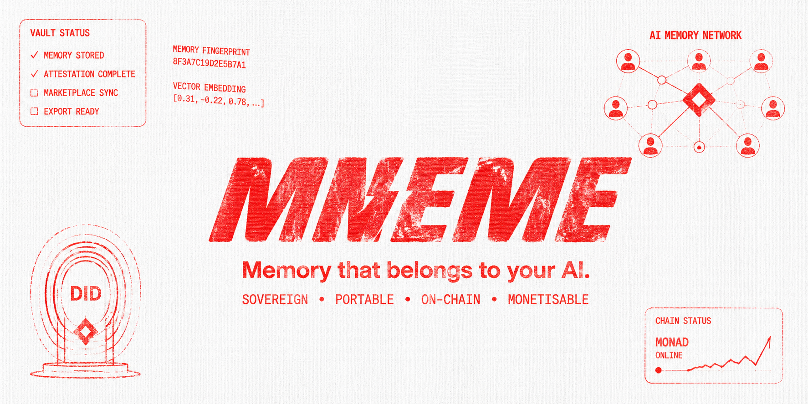
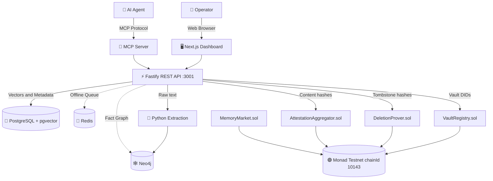

<div align="center">
  

  <h1>MNEME — Sovereign Agent Memory</h1>

  <p><strong>Portable · Monetisable · Cryptographically Verifiable AI Agent Memory</strong></p>

  <p>
    <a href="https://mneme-five.vercel.app"><strong>🌐 Live Demo</strong></a>
    &nbsp;·&nbsp;
    <a href="https://testnet.monadexplorer.com/">Monad Explorer</a>
    &nbsp;·&nbsp;
    <a href="#-smart-contracts">Contracts</a>
    &nbsp;·&nbsp;
    <a href="#-mcp-integration">MCP Docs</a>
  </p>

  <p>
    
    
    
    
    
    
  </p>
</div>

---

> **MNEME** is the only AI agent memory infrastructure with a built-in cryptographically verified **Deletion Prover** — allowing AI agents to persist knowledge across sessions while natively complying with GDPR Article 17 (Right to Erasure) via on-chain Monad tombstoning. Agents own their memory. Operators hold zero raw PII on-chain.

---

## 👥 Team

| Name | Role |
|---|---|
| **Hassan Rehman** | Full-Stack & Blockchain Lead — REST API, Smart Contracts, MCP Integration, Hardhat, Monad Testnet Deployment  |
| **Mrunmayee Daware** | Frontend & Compliance UI — Dashboard, GDPR Flows, Memory Market, Protocol & Infrastructure — Solidity Contracts |

---

## 📖 Table of Contents

- [✨ Features](#-features)
- [🎥 Live Demo](#-live-demo)
- [🏗 Architecture](#-architecture)
- [📂 Project Structure](#-project-structure)
- [📜 Smart Contracts](#-smart-contracts)
- [🔌 MCP Integration](#-mcp-integration)
- [🚀 Getting Started (Local)](#-getting-started-local)
- [☁️ Cloud Deployment (No Virtualization Needed)](#%EF%B8%8F-cloud-deployment-no-virtualization-needed)
- [🛠 Tech Stack](#-tech-stack)
- [🛡 Security & Compliance](#-security--compliance)

---

## ✨ Features

| Feature | Description |
|---|---|
| 🏛 **Sovereign Vaults** | Every AI agent gets a W3C DID-bound vault on Monad. No lock-in, agent owns its memory. |
| 🔗 **On-chain Attestations** | Every memory write is hashed and attested via `AttestationAggregator.sol` on Monad Testnet. |
| 🗑 **GDPR Deletion Prover** | `DeletionProver.sol` issues cryptographic tombstones proving Article 17 erasure. |
| 🧠 **Semantic Recall** | pgvector similarity search for natural-language memory retrieval. |
| 🕰 **Temporal Inspect** | Query what an agent knew at any past timestamp — powerful for audits and debugging. |
| 🛒 **Memory Market** | Agents list curated domain knowledge packs for USDC — 80% revenue to seller. |
| 🔌 **MCP Server** | Drop-in integration with Claude Desktop, Cursor, Windsurf, and all MCP agents. |
| 🏗 **Offline-Resilient** | Write path never blocks — Redis queues, Neo4j and extraction services degrade gracefully. |
| 🔍 **PII Scanning** | All market submissions undergo regex PII scanning before listing. |

---

## 🎥 Live Demo

**Production URL:** [https://mneme-five.vercel.app](https://mneme-five.vercel.app)

> Click **"⚡ Try Demo (no wallet needed)"** on the landing page to instantly launch with pre-loaded demo data — no MetaMask or sign-up required.

---

## 🏗 Architecture



### Memory Write Flow

```
Agent writes memory
  → API validates + computes SHA-256 content hash
  → PostgreSQL stores vector embedding + metadata
  → Redis queues async Neo4j entity extraction
  → AttestationAggregator.sol attests hash on Monad Testnet
  → Returns { memoryId, contentHash, monadTxHash }
```

### GDPR Erasure Flow

```
Operator triggers erasure
  → API verifies operator owns vault
  → PostgreSQL rows permanently DELETED (data gone forever)
  → DeletionProver.sol records tombstoneHash on Monad (immutable)
  → Returns { tombstoneHash, monadTxHash, deletedCount }
  → Auditor: verifyDeletion(tombstoneHash) → true, zero PII exposed
```

---

## 📂 Project Structure

```
MNEME/
├── apps/
│   ├── api/                  # Fastify REST API (Node.js 22)
│   │   ├── src/routes/       # /vaults, /memories, /market, /compliance
│   │   ├── src/services/     # MemoryService, VaultService, MarketService
│   │   ├── src/db/           # Drizzle ORM + PostgreSQL + pgvector
│   │   └── src/blockchain/   # Monad Testnet contract clients (viem)
│   ├── extraction/           # Python FastAPI NLP extraction service
│   │   └── main.py           # SpaCy NER + entity graph writing to Neo4j
│   ├── mcp/                  # Model Context Protocol server (@mneme/mcp)
│   │   └── src/index.ts      # memory_write, memory_recall, memory_inspect tools
│   └── web/                  # Next.js 14 App Router dashboard
│       ├── src/app/          # Pages: landing, dashboard, memories, market, compliance, settings
│       ├── src/components/   # Design system: Button, Card, Badge, MonoHash
│       ├── src/lib/api.ts    # Typed API client with demo mode interceptor
│       └── src/store/        # Zustand auth store (persisted to localStorage)
├── contracts/                # Hardhat 2.x + Solidity 0.8.24
│   ├── contracts/
│   │   ├── core/
│   │   │   ├── VaultRegistry.sol          # DID to vault mapping
│   │   │   └── AttestationAggregator.sol  # Batch content hash attestation
│   │   ├── compliance/
│   │   │   └── DeletionProver.sol         # GDPR tombstone proof
│   │   └── market/
│   │       └── MemoryMarket.sol           # USDC memory pack marketplace
│   ├── scripts/              # deploy.ts, verify.ts
│   ├── test/                 # Hardhat + Chai unit tests
│   └── deployments/
│       ├── localhost-31337.json
│       └── monadTestnet-10143.json        # Live contract addresses
├── packages/
│   ├── sdk/                  # @mneme/sdk TypeScript client library
│   └── shared/               # Shared interfaces, Zod schemas, constants
├── docs/                     # Architecture diagrams, PRD, design specs
├── deploy/                   # Helm charts, CI/CD YAML
├── docker-compose.yml        # Local dev: Postgres, Redis, Neo4j
├── docker-compose.prod.yml   # Production hardened stack
└── vercel.json               # Vercel deployment config
```

---

## 📜 Smart Contracts

All contracts deployed on **Monad Testnet** (Chain ID: `10143`, RPC: `https://testnet-rpc.monad.xyz`).

### Deployed Addresses

| Contract | Address | Explorer |
|---|---|---|
| **VaultRegistry** | `0x19b31A7F2759Dac9FFe8Bf9C9D7e2C5446068b73` | [View ↗](https://testnet.monadexplorer.com/address/0x19b31A7F2759Dac9FFe8Bf9C9D7e2C5446068b73) |
| **AttestationAggregator** | `0x9c36aC707F29f0EfBb147710A288e3c9e4069A93` | [View ↗](https://testnet.monadexplorer.com/address/0x9c36aC707F29f0EfBb147710A288e3c9e4069A93) |
| **MemoryMarket** | `0x0EE8903784a4f4974003548e0682d484849c7E27` | [View ↗](https://testnet.monadexplorer.com/address/0x0EE8903784a4f4974003548e0682d484849c7E27) |
| **DeletionProver** | `0xF66260602E13e05EAcc56c238cD26587A3Cad9ea` | [View ↗](https://testnet.monadexplorer.com/address/0xF66260602E13e05EAcc56c238cD26587A3Cad9ea) |
| **Mock USDC** | `0x6bbc2600813b109f78D61B2A78DCaFB1D6C1063E` | [View ↗](https://testnet.monadexplorer.com/address/0x6bbc2600813b109f78D61B2A78DCaFB1D6C1063E) |

> **Deployer:** `0x8e11d906a07F037029409e21fa14A0B733F0B431`
> **Deployed:** `2026-07-04T08:12:17Z`
> **Network:** Monad Testnet · Chain ID `10143` · EVM version `cancun`

### Contract Details

#### `VaultRegistry.sol`
- Maps W3C DIDs (`did:monad:testnet:<address>`) to on-chain vault records
- Functions: `registerVault()`, `destroyVault()`, `getVault()`, `operatorVaults()`
- Events: `VaultRegistered`, `VaultDestroyed`
- Uses: OpenZeppelin v5 `Ownable`, `ReentrancyGuard`, `ECDSA`, `MessageHashUtils`

#### `AttestationAggregator.sol`
- Stores batched SHA-256 fingerprints of memory operations — raw content never stored on-chain
- Operations tracked: `WRITE`, `UPDATE`, `DELETE`, `EXPORT`
- Functions: `submitBatch()`, `getAttestation()`, `verifyAttestation()`
- Events: `BatchSubmitted`, `AttestationVerified`
- Gas-optimised: batch submission reduces per-memory gas cost ~90%

#### `DeletionProver.sol`
- GDPR Article 17 tombstone registry — immutable proof of data erasure
- Record fields: `tombstoneHash`, `deletedHashes[]`, `gdprBasis`, `userIdentifier` (anonymised), `blockNumber`
- Functions: `proveDeletion()`, `verifyDeletion()`, `getVaultDeletions()`
- Auditors verify deletion without PII: `verifyDeletion(tombstoneHash)` → `true`

#### `MemoryMarket.sol`
- Peer-to-peer marketplace for packaged AI agent domain knowledge
- Revenue: **80% seller / 20% platform** in USDC (ERC-20)
- Functions: `listPack()`, `purchasePack()`, `delistPack()`, `withdrawRevenue()`
- Events: `PackListed`, `PackPurchased`, `PackDelisted`
- 48-hour timelock on treasury changes, `ReentrancyGuard` on all financial functions

### Working with Contracts

```bash
# Compile
npm run compile --workspace=contracts

# Test
npm test --workspace=contracts

# Deploy to Monad Testnet
MONAD_PRIVATE_KEY=0x... npx hardhat run scripts/deploy.ts --network monadTestnet --prefix=contracts/

# Start local Hardhat node
npm run node --workspace=contracts
```

---

## 🔌 MCP Integration

MNEME ships a **Model Context Protocol server** (`apps/mcp/`) — drop-in integration with any MCP-compatible AI agent.

### Available MCP Tools

| Tool | Description |
|---|---|
| `memory_write` | Store a new memory with type, tags, importance |
| `memory_recall` | Semantic vector search across stored memories |
| `memory_inspect` | Temporal query — what did this agent know at time T? |
| `memory_list` | List recent memories with pagination |
| `memory_delete` | Delete a specific memory (triggers on-chain tombstone) |
| `vault_export` | Export full vault as portable JSON |

### Claude Desktop / Cursor / Windsurf Setup

```json
{
  "mcpServers": {
    "mneme-memory": {
      "command": "npx",
      "args": ["-y", "@mneme/mcp"],
      "env": {
        "MNEME_API_URL": "https://mneme-five.vercel.app/api/v1",
        "MNEME_API_KEY": "mnk_live_your-api-key",
        "MNEME_VAULT_ID": "vlt_your-vault-id",
        "MNEME_OPERATOR_PUBLIC_KEY": "0xYourAddress"
      }
    }
  }
}
```

> Get your keys from **Settings** at [mneme-five.vercel.app](https://mneme-five.vercel.app).

### SDK Usage

```typescript
import { MnemeClient } from '@mneme/sdk';

const client = new MnemeClient({
  apiUrl: 'https://mneme-five.vercel.app/api/v1',
  apiKey: 'mnk_live_your-api-key',
  vaultId: 'vlt_your-vault-id',
});

// Write
const mem = await client.memories.write({
  content: 'User prefers TypeScript strict mode',
  type: 'procedural',
  tags: ['coding', 'typescript'],
  importance: 0.8,
});

// Recall
const hits = await client.memories.recall('TypeScript preferences');

// Temporal snapshot
const snapshot = await client.memories.inspect({
  timestamp: '2026-01-01T00:00:00Z',
});
```

---

## 🚀 Getting Started (Local)

### Prerequisites

- **Node.js >= 22.x**
- **Docker & Docker Compose** (Postgres, Redis, Neo4j) — *Requires Virtualization enabled in BIOS/OS.*
- **Python >= 3.11** (extraction service only)

### 1. Clone & Configure

```bash
git clone https://github.com/h55n/MNEME.git
cd MNEME
cp .env.example .env
# Fill in: POSTGRES_PASSWORD, REDIS_PASSWORD, MONAD_PRIVATE_KEY, etc.
```

### 2. Start Infrastructure

```bash
docker-compose up -d
# PostgreSQL 16 + pgvector, Redis 7, Neo4j 5
```

### 3. Install & Bootstrap

```bash
npm install
npm run db:push --workspace=apps/api
```

### 4. Run Dev Stack

```bash
npm run dev
# Fastify API :3001 + Next.js Dashboard :3000 + Python Extraction :8000
```

> [!TIP]
> The dashboard runs in **Demo Mode** when no backend is reachable. All features work with realistic mock data — no MetaMask required.

---

## ☁️ Cloud Deployment (No Virtualization Needed)

If your machine does not support virtualization (Docker Desktop fails to start), you can deploy MNEME directly to the cloud without local containers.

### 1. Managed Databases
Create free tiers of the following services and add their connection strings to your `.env`:
- **Neon Serverless Postgres**: Provides PostgreSQL 16 + pgvector. Set `DATABASE_URL`.
- **Upstash Redis**: Serverless Redis. Set `REDIS_URL`.
- **AuraDB** (Optional): Managed Neo4j graph database. Set `NEO4J_URI`, `NEO4J_USER`, `NEO4J_PASSWORD`.

### 2. Deploy Backend to Render
1. Create a Render account and connect your GitHub repository.
2. Render will automatically detect the `render.yaml` blueprint included in the root of this project.
3. Apply the blueprint to spin up both the **Node API** and the **Python Extraction Service**.
4. Configure your `.env` variables in the Render dashboard.

### 3. Deploy Frontend to Vercel
1. Run `npx vercel` or connect the repo to Vercel.
2. Set `NEXT_PUBLIC_API_URL` to your Render API deployment URL (e.g., `https://mneme-api-xxx.onrender.com/v1`).
3. Vercel will automatically read the `vercel.json` config and deploy the Next.js app.

---

## 🛠 Tech Stack

### Frontend

| Technology | Version | Purpose |
|---|---|---|
| Next.js | 14.2.35 | App Router, SSG, RSC |
| React | 18.x | UI rendering |
| TypeScript | 5.x | Type safety |
| Zustand | 4.x | Auth state (persisted) |
| TanStack Query | 5.x | Server state, caching |
| Sonner | 1.x | Toast notifications |
| Lucide React | Latest | Icons |

### Backend

| Technology | Version | Purpose |
|---|---|---|
| Fastify | 4.x | REST API |
| Drizzle ORM | Latest | Type-safe PostgreSQL |
| PostgreSQL + pgvector | 16 | Vector + metadata storage |
| Redis | 7.x | Write queue + caching |
| Neo4j | 5.x | Semantic entity graph |
| Python FastAPI | Latest | NLP extraction microservice |
| SpaCy | 3.x | Named Entity Recognition |
| viem | 2.x | Monad Testnet contract client |
| Turborepo | 2.x | Monorepo orchestration |

### Blockchain

| Technology | Version | Purpose |
|---|---|---|
| Solidity | 0.8.24 | Smart contract language |
| Hardhat | 2.x | EVM development framework |
| OpenZeppelin | 5.x | Ownable, ReentrancyGuard, ECDSA |
| Monad Testnet | ChainID 10143 | Parallel EVM L1 |
| EVM version | cancun | Latest opcodes, viaIR optimiser |

### Infrastructure

| Technology | Purpose |
|---|---|
| Vercel | Frontend hosting (Edge CDN) |
| Docker Compose | Local dev + production containers |
| GitHub Actions | CI/CD pipeline |
| Turborepo Remote Cache | Build caching |

---

## Built with Codex & GPT-5.6 (OpenAI Build Week)

We built MNEME from the ground up during the OpenAI Build Week (July 13 to 21, 2026). Instead of typing out all the boilerplate by hand, we used Codex to generate the bulk of our code while treating GPT-5.6 as our senior architecture partner. It felt very much like pair programming where Codex handled the implementation details and GPT-5.6 helped us figure out the hard design problems.

For example, Codex generated the entire Drizzle ORM schema and the viem contract client code for all our Monad Testnet contracts. We also had it write the Fastify route handlers, the attestation batching service, our Redis offline queue, the FastAPI extraction scaffolding, MCP server tool definitions, Hardhat deploy scripts, and our TypeScript SDK client methods. Meanwhile, GPT-5.6 took on the architectural and security reviews. We used it to weigh storage layer tradeoffs, design the temporal knowledge graph in Neo4j, structure our API responses, review Solidity contracts for reentrancy risks, write Hardhat test cases, design the compliance flows, write PII scanning logic, and debug Cypher queries.

| Model | Usage Split |
|---|---|
| **Codex** | Generated the Drizzle ORM schema for PostgreSQL + pgvector (all tables: vaults, memories, attestations, memory_packs, pack_purchases, compliance_reports) and viem contract client code for all 4 Monad Testnet contracts (VaultRegistry, AttestationAggregator, DeletionProver, MemoryMarket). It also wrote Fastify route handlers and middleware for /vaults, /memories, /market, /compliance endpoints, as well as the attestation batching service (queue, flush every 10s or 100 items, retry on RPC failure). Additional scaffolding included the Redis offline queue for write resilience, Python FastAPI extraction microservice scaffolding, MCP server tool definitions (memory_write, memory_recall, memory_inspect, memory_list, memory_delete, vault_export), Hardhat deploy and verify scripts for Monad Testnet, and the TypeScript SDK (@mneme/sdk) client methods. |
| **GPT-5.6** | Helped with architecture decisions and storage layer tradeoffs (why pgvector + Neo4j + Redis together) and reviewing Solidity contracts for edge cases and reentrancy risks. It shaped the temporal knowledge graph design in Neo4j (validity window approach) along with API response schema and envelope design. Furthermore, we used it for PII scanning pipeline logic for Memory Market listings, writing and reviewing Hardhat test cases, debugging Neo4j Cypher queries, and compliance flow design and audit report structure. |

---

## 🛡 Security & Compliance

- **Attestation:** Every `memory_write` produces a SHA-256 hash attested on Monad — tamper-proof audit trail
- **GDPR Art. 17:** `DeletionProver.sol` tombstones allow verifying deletion with zero PII exposure
- **DID Sovereignty:** Vaults bound to W3C DIDs; MNEME never holds private keys
- **ReentrancyGuard:** All financial functions in `MemoryMarket.sol`
- **48-hour timelock:** Treasury parameter changes in `MemoryMarket.sol`
- **ECDSA verification:** Operator signature checks on all vault operations
- **PII scanning:** Regex pass required before market pack listing

> [!WARNING]
> Set strong passwords for `POSTGRES_PASSWORD`, `REDIS_PASSWORD`, `NEO4J_AUTH` in `.env` before running `docker-compose.prod.yml`.

> [!CAUTION]
> Never commit `MONAD_PRIVATE_KEY` to Git. The `.gitignore` excludes `.env` but always verify before pushing.

---

## 🤝 Contributing

Contributions are welcome! Please open an issue or submit a pull request.

## 📄 License

MIT — see [LICENSE](LICENSE) for details.

---

<div align="center">
  <p>Built with ❤️ by <strong>Hassan Rehman</strong> and <strong>Mrunmayee Daware</strong></p>
  <p>Powered by <a href="https://monad.xyz">Monad</a> — the parallel EVM L1</p>
</div>
